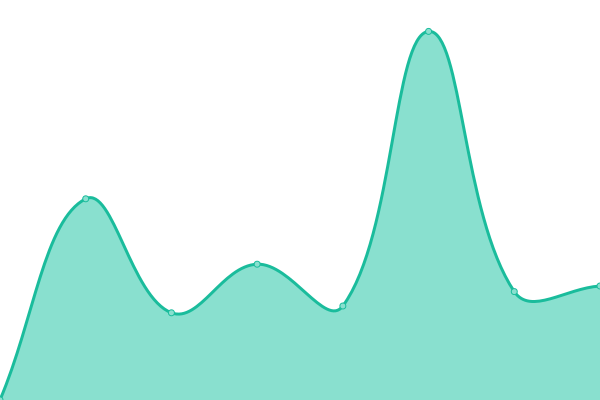

# [📈 Live Status](https://pinnode.github.io/pinnode): <!--live status--> **🟧 Partial outage**

This repository contains the open-source uptime monitor and status page for [Upptime](https://upptime.js.org), powered by [Upptime](https://github.com/upptime/upptime).

With [Upptime](https://upptime.js.org), you can get your own unlimited and free uptime monitor and status page, powered entirely by a GitHub repository. We use [Issues](https://github.com/upptime/upptime/issues) as incident reports, [Actions](https://github.com/pinnode/pinnode/actions) as uptime monitors, and [Pages](https://demo.upptime.js.org) for the status page.

<!--start: status pages-->
<!-- This summary is generated by Upptime (https://github.com/upptime/upptime) -->
<!-- Do not edit this manually, your changes will be overwritten -->
<!-- prettier-ignore -->
| URL | Status | History | Response Time | Uptime |
| --- | ------ | ------- | ------------- | ------ |
|  [jeju 4.3](http://43archives.or.krr/main.do) | 🟥 Down | [jeju-4-3.yml](https://github.com/pinnode/pinnode/commits/HEAD/history/jeju-4-3.yml) | 

 0ms
     
 | 

<a href="https://pinnode.github.io/pinnode/history/jeju-4-3">0.15%</a>
    

|  [emusium](https://www.emuseum.go.kr/main) | 🟩 Up | [emusium.yml](https://github.com/pinnode/pinnode/commits/HEAD/history/emusium.yml) | 

 1708ms
     
 | 

<a href="https://pinnode.github.io/pinnode/history/emusium">100.00%</a>
    

|  [ggmemory](https://memory.library.krr/main) | 🟥 Down | [ggmemory.yml](https://github.com/pinnode/pinnode/commits/HEAD/history/ggmemory.yml) | 

 0ms
     
 | 

<a href="https://pinnode.github.io/pinnode/history/ggmemory">0.15%</a>
    

|  [google](https://www.google.com) | 🟩 Up | [google.yml](https://github.com/pinnode/pinnode/commits/HEAD/history/google.yml) | 

 60ms
     
 | 

<a href="https://pinnode.github.io/pinnode/history/google">0.00%</a>
    

|  [digital hangeul](http://hangeul.pinnode.net/) | 🟩 Up | [digital-hangeul.yml](https://github.com/pinnode/pinnode/commits/HEAD/history/digital-hangeul.yml) | 

 2012ms
     
 | 

<a href="https://pinnode.github.io/pinnode/history/digital-hangeul">100.00%</a>
    

<!--end: status pages-->

[**Visit our status website →**](https://pinnode.github.io/pinnode)
