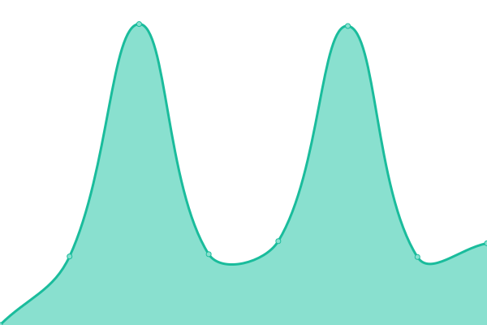

# [📈 Live Status](https://pinnode.github.io/pinnode): <!--live status--> **🟧 Partial outage**

This repository contains the open-source uptime monitor and status page for [Upptime](https://upptime.js.org), powered by [Upptime](https://github.com/upptime/upptime).

With [Upptime](https://upptime.js.org), you can get your own unlimited and free uptime monitor and status page, powered entirely by a GitHub repository. We use [Issues](https://github.com/upptime/upptime/issues) as incident reports, [Actions](https://github.com/pinnode/pinnode/actions) as uptime monitors, and [Pages](https://demo.upptime.js.org) for the status page.

<!--start: status pages-->
<!-- This summary is generated by Upptime (https://github.com/upptime/upptime) -->
<!-- Do not edit this manually, your changes will be overwritten -->
<!-- prettier-ignore -->
| URL | Status | History | Response Time | Uptime |
| --- | ------ | ------- | ------------- | ------ |
|  [jeju43](http://43archives.or.kr/main.do) | 🟩 Up | [jeju43.yml](https://github.com/pinnode/pinnode/commits/HEAD/history/jeju43.yml) | 

 3162ms
     
 | 

<a href="https://pinnode.github.io/pinnode/history/jeju43">99.28%</a>
    

|  [jeju43admin](http://43archives.or.kr/admin) | 🟩 Up | [jeju43admin.yml](https://github.com/pinnode/pinnode/commits/HEAD/history/jeju43admin.yml) | 

 323ms
     
 | 

<a href="https://pinnode.github.io/pinnode/history/jeju43admin">100.00%</a>
    

|  [jp](https://archives.jp.go.kr/) | 🟩 Up | [jp.yml](https://github.com/pinnode/pinnode/commits/HEAD/history/jp.yml) | 

 3280ms
     
 | 

<a href="https://pinnode.github.io/pinnode/history/jp">100.00%</a>
    

|  [jpadmin](https://archives.jp.go.kr/admin) | 🟩 Up | [jpadmin.yml](https://github.com/pinnode/pinnode/commits/HEAD/history/jpadmin.yml) | 

 494ms
     
 | 

<a href="https://pinnode.github.io/pinnode/history/jpadmin">100.00%</a>
    

|  [ggmemory](https://memory.library.kr/main) | 🟩 Up | [ggmemory.yml](https://github.com/pinnode/pinnode/commits/HEAD/history/ggmemory.yml) | 

 5381ms
     
 | 

<a href="https://pinnode.github.io/pinnode/history/ggmemory">100.00%</a>
    

|  [hangeul](https://archives.hangeul.go.kr/) | 🟩 Up | [hangeul.yml](https://github.com/pinnode/pinnode/commits/HEAD/history/hangeul.yml) | 

 2419ms
     
 | 

<a href="https://pinnode.github.io/pinnode/history/hangeul">99.89%</a>
    

|  [hangeulcms](http://mms.hangeul.go.kr:9001/login) | 🟩 Up | [hangeulcms.yml](https://github.com/pinnode/pinnode/commits/HEAD/history/hangeulcms.yml) | 

 712ms
     
 | 

<a href="https://pinnode.github.io/pinnode/history/hangeulcms">100.00%</a>
    

|  [Kculture](http://www.kcultureroad.kr/) | 🟩 Up | [kculture.yml](https://github.com/pinnode/pinnode/commits/HEAD/history/kculture.yml) | 

 2873ms
     
 | 

<a href="https://pinnode.github.io/pinnode/history/kculture">100.00%</a>
    

|  [Kcultureadmin](http://www.kcultureroad.kr/login) | 🟩 Up | [kcultureadmin.yml](https://github.com/pinnode/pinnode/commits/HEAD/history/kcultureadmin.yml) | 

 216ms
     
 | 

<a href="https://pinnode.github.io/pinnode/history/kcultureadmin">100.00%</a>
    

|  [ggmemoryadmin](https://memorysuper.library.kr) | 🟥 Down | [ggmemoryadmin.yml](https://github.com/pinnode/pinnode/commits/HEAD/history/ggmemoryadmin.yml) | 

 5222ms
     
 | 

<a href="https://pinnode.github.io/pinnode/history/ggmemoryadmin">0.00%</a>
    

|  [hangeuladmin](http://mms.hangeul.go.kr:9002/login) | 🟥 Down | [hangeuladmin.yml](https://github.com/pinnode/pinnode/commits/HEAD/history/hangeuladmin.yml) | 

 0ms
     
 | 

<a href="https://pinnode.github.io/pinnode/history/hangeuladmin">0.00%</a>
    

<!--end: status pages-->

[**Visit our status website →**](https://pinnode.github.io/pinnode)
